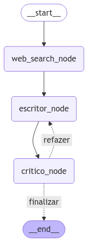

 
 Este código é um exemplo de um sistema de geração de artigos automatizado usando uma LLM (Linguagem de Modelos de Largura) e avaliação por um especialista em análise textual. O sistema é composto por três principais componentes: pesquisa web, geração de artigos e avaliação do artigo.

Componentes do Sistema
Pesquisa Web: O código usa a ferramenta TavilySearchResults do pacote langchain_community.tools.tavily_search para realizar pesquisas na web com base no tema do artigo. 
Os resultados são armazenados no estado do gráfico.
Geração de Artigos: O código usa uma LLM, neste caso, ChatAnthropic, para gerar o artigo. O prompt de escrita é definido na variável prompt_escritor e o resultado é armazenado no estado do gráfico.
Avaliação do Artigo: O código usa uma LLM, neste caso, ChatAnthropic, para avaliar o artigo. O prompt de avaliação é definido na variável prompt_critico e o resultado é armazenado no estado do gráfico.
Fluxo do Sistema
O fluxo do sistema é controlado por um gráfico de estado, chamado work_flow, que define as transições entre os diferentes nós do sistema. Os nós do gráfico são:

web_search_node: Realiza a pesquisa web com base no tema do artigo.
escritor_node: Gera o artigo com base nos resultados da pesquisa web.
critico_node: Avalia o artigo gerado.
O fluxo do sistema é definido pelas seguintes transições:

START -> web_search_node
web_search_node -> escritor_node
escritor_node -> critico_node
O fluxo do sistema também inclui uma transição condicional, que decide se o artigo precisa ser refeito ou pode ser finalizado com base na nota e número de iterações.

Variáveis de Ambiente
O código requer duas variáveis de ambiente para funcionar corretamente: ANTHROPIC_API_KEY e TAVILY_API_KEY. Certifique-se de que essas variáveis estejam definidas corretamente antes de executar o código.
